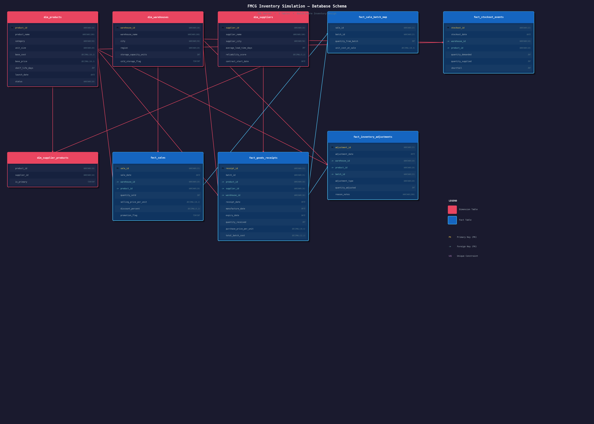

# Batch-Aware FMCG Inventory Analytics — End-to-End Data Pipeline

**Author:** Indranil Mukherjee | Data Analyst | SQL | Power BI

---

## Project Overview

This project simulates a realistic batch-aware inventory system for a national FMCG distribution network handling perishable goods with very short shelf lives (5–10 days). The goal was to build a complete end-to-end analytics pipeline — from synthetic data generation through to an interactive Power BI dashboard — that enables meaningful supply chain analysis.

The dataset is structurally clean but behaviourally complex, designed to surface real operational challenges: expiry losses, stockout patterns, supplier reliability variance, and margin volatility driven by cost inflation cycles.

### Key Analytical Questions This Project Answers
- Which product categories have the highest expiry loss rates?
- Which warehouses are losing the most revenue to expired stock?
- Where are stockouts concentrated — by warehouse and category?
- Which suppliers are unreliable or cost-volatile?
- How does gross margin vary across categories and months?
- What is the current inventory aging profile and which batches are at risk?

---

## Pipeline Architecture

```
Python Simulation
      ↓
  CSV Files (9 tables)
      ↓
SQL Server (FMCG_Inventory)
      ↓
Staging Layer (SQL Views)
      ↓
Analytical Queries (17 SQL queries)
      ↓
Power BI Dashboard (6 pages)
```

### Tech Stack
| Layer | Tool |
|---|---|
| Data Generation | Python (pandas, numpy) |
| Database | SQL Server (localhost) |
| Query Language | T-SQL |
| Visualisation | Power BI Desktop |
| Version Control | GitHub |

---

## Simulation Scope

| Parameter | Value |
|---|---|
| Products | 25 (5 categories) |
| Warehouses | 5 (5 regions) |
| Suppliers | 12 |
| Simulation Period | 365 days (2024-01-01 to 2024-12-30) |
| Product Shelf Life | 5–10 days |
| Expected Sales Rows | 60k–90k |

### Product Categories and Shelf Life
| Category | Shelf Life |
|---|---|
| Bread | 5 days |
| Ready Meals | 6 days |
| Milk | 7 days |
| Fresh Juice | 9 days |
| Yogurt | 10 days |

---

## Dataset — 9 Tables

### Dimension Tables
| Table | Rows | Description |
|---|---|---|
| dim_products | 25 | SKU catalog with base cost, price, shelf life |
| dim_warehouses | 5 | Warehouse locations, regions, cold storage flags |
| dim_suppliers | 12 | Supplier details, lead times, reliability scores |
| dim_supplier_products | ~61 | Junction table — which suppliers supply which products |

### Fact Tables
| Table | Rows | Description |
|---|---|---|
| fact_sales | ~63,000 | Daily sale transactions per product per warehouse |
| fact_goods_receipts | ~9,500 | Batch deliveries into warehouses |
| fact_sale_batch_map | ~74,000 | Batch-level cost allocation per sale |
| fact_inventory_adjustments | ~6,300 | Expiry write-offs and shrinkage events |
| fact_stockout_events | ~3,400 | Days where demand exceeded available stock |

---

## Schema Diagram



---

## Key Design Decisions

### 1. No batch_id on sales table
Sales records do not contain a batch_id. Customers don't always buy the oldest batch, so batch allocation is handled separately in `fact_sale_batch_map` using random batch selection. This is more realistic than assuming FIFO at point of sale.

### 2. Random batch allocation (not FIFO)
When a sale occurs, batches are allocated randomly rather than oldest-first. This deliberately increases expiry losses — batches can expire while newer stock is being sold — which creates more analytically interesting expiry patterns.

### 3. Dynamic reorder trigger
Reorder threshold is calculated per product per warehouse:
```
Reorder when: coverage_days < (supplier_lead_time + 1)
```
This means a product supplied by a 3-day lead time supplier reorders at 4 days coverage, while a 1-day supplier reorders at 2 days. Not a fixed global constant.

### 4. Cold storage constraint
W003 Eastern Fulfilment Centre has no cold storage. This means it only stocks Bread — all other categories require refrigeration. This creates a natural performance outlier in the warehouse analysis.

### 5. Multi-transaction per day
Each product/warehouse combination generates 1–3 separate sale transactions per day rather than one. This produces a realistic ~63,000 row sales table and reflects multiple customer orders per day.

### 6. Cost volatility and inflation
Purchase price per batch varies ±8% randomly. Q3 (July–September) applies a 5% inflation uplift and Q1 applies a 4% dip. This drives visible gross margin compression in Q3 across all categories.

### 7. PKs and FKs in SQL Server only
Primary keys and foreign keys are applied in SQL Server after loading, not during Python generation. This follows a clean separation — Python handles simulation behaviour, SQL handles data integrity.

---

## How to Run

### Prerequisites
- Python 3.8+
- SQL Server (local instance)
- SQL Server Management Studio (SSMS)
- Power BI Desktop
- Python packages: `pandas`

### Step 1 — Clone the repository
```bash
git clone https://github.com/[your-username]/fmcg-inventory-analytics
cd fmcg-inventory-analytics
```

### Step 2 — Install dependencies
```bash
pip install pandas
```

### Step 3 — Generate the dataset
```bash
python run.py
```
This runs `master_data.py` and `simulation.py` in sequence and writes 9 CSV files to the `output/` folder.

### Step 4 — Set up SQL Server
Open SSMS and run the three SQL scripts in order:
```
01_create_database_and_tables.sql   ← run once
02_stored_procedures.sql            ← run once
03_reload_data.sql                  ← run every time you refresh data
```

### Step 5 — Open Power BI
Open `FMCG_Inventory_Dashboard.pbix` in Power BI Desktop.
- Connection: SQL Server → localhost → FMCG_Inventory → Import mode
- Refresh the dataset if prompted

---

## SQL Scripts Guide

| Script | Purpose | When to Run |
|---|---|---|
| `01_create_database_and_tables.sql` | Creates database, all 9 tables, PKs, FKs | Once only |
| `02_stored_procedures.sql` | Creates 4 stored procedures for data loading | Once only |
| `03_reload_data.sql` | Disables FKs, clears tables, reloads all CSVs, re-enables FKs | Every data refresh |

### Stored Procedures
| Procedure | Purpose |
|---|---|
| `usp_DisableConstraints` | Disables all FK constraints before loading |
| `usp_TruncateAllTables` | Clears all 9 tables in correct dependency order |
| `usp_LoadAllData` | BULK INSERTs all 9 CSVs from output folder |
| `usp_EnableConstraints` | Re-enables and validates all FK constraints |

---

## Data Quality Checks

Before moving to analysis, 5 data quality checks were run to validate the dataset:

| Check | Query | Expected Result | Outcome |
|---|---|---|---|
| A | Sales with zero or negative quantity | 0 rows | ✅ Pass |
| B | Batches expired before receipt date | 0 rows | ✅ Pass |
| C | Zero quantities in batch map | 0 rows | ✅ Pass (bug fixed) |
| D | Orphaned sale IDs in batch map | 0 rows | ✅ Pass |
| E | Orphaned batch IDs in batch map | 0 rows | ✅ Pass |

**Check C** revealed a simulation bug — when a sale split across multiple transactions and the first transaction consumed all stock, subsequent transactions were writing zero-quantity batch map records. Fixed by adding a `if take > 0` guard in `simulation.py` before appending to the batch map log.

**Principle:** Always validate data before analysis. Building reports on unvalidated data risks incorrect insights that look credible.

---

## SQL Analysis — 17 Queries

### Layer 1 — Exploration and Validation
| # | Query |
|---|---|
| 1 | Row count validation across all 9 tables |
| 2 | Sales date range and scope validation |
| 3 | Sales volume and revenue by warehouse |
| 4 | Sales transactions by product category |
| 5 | Data quality checks A through E |

### Layer 2 — Staging Views
| View | Tables Joined |
|---|---|
| `vw_sales_enriched` | fact_sales + dim_products + dim_warehouses |
| `vw_goods_receipts_enriched` | fact_goods_receipts + dim_products + dim_warehouses + dim_suppliers |
| `vw_inventory_adjustments_enriched` | fact_inventory_adjustments + dim_products + dim_warehouses |

### Layer 3 — Analytical Queries
| # | Query | Analysis Area |
|---|---|---|
| 6 | Total expiry loss by category | Expiry |
| 7 | Expiry loss rate % by category | Expiry |
| 8 | Expiry loss by warehouse | Expiry |
| 9 | Stockout rate by warehouse and category | Stockout |
| 10 | Supplier delivery activity | Supplier |
| 11 | Supplier lead time and cost volatility | Supplier |
| 12 | Gross margin by category and month | Margin |
| 13 | Warehouse performance scorecard | Warehouse |
| 14 | Active batch inventory at simulation end | Aging |
| 15 | Inventory aging summary by warehouse | Aging |
| 16 | Cumulative revenue and expiry loss by month | Window Functions |
| 17 | Warehouse performance ranking | Window Functions |

### Key SQL Concepts Used
- CTEs (up to 4 levels deep)
- Window functions — `SUM() OVER()`, `RANK()`, `DENSE_RANK()`
- `NULLIF` for divide-by-zero protection
- `ISNULL` for NULL handling in LEFT JOINs
- Subqueries inside JOINs
- `CAST AS DECIMAL` for precise decimal handling
- Stored procedures with dynamic SQL for constraint management

---

## Power BI Dashboard — 6 Pages

### Page 1 — Executive Summary
High-level KPIs: Total Revenue, Expiry Loss, Stockout Events, Expiry % of Revenue, Gross Margin %. Monthly revenue trend, revenue by category, revenue vs expiry loss by warehouse.

### Page 2 — Expiry Loss Analysis
Expiry loss value and rate by category, expiry loss by warehouse treemap, monthly expiry loss trend.

### Page 3 — Stockout Analysis
Stockout events and units short KPIs, monthly stockout trend, warehouse vs category heatmap, stockout rate by category.

### Page 4 — Supplier Performance
Monthly purchase price trend showing Q3 inflation effect, supplier reliability vs price scatter plot, reliability scores, batch volumes by supplier.

### Page 5 — Gross Margin Analysis
Monthly gross margin trend, gross margin by category, revenue breakdown (cost vs profit), gross margin heatmap by category and month.

### Page 6 — Inventory Aging
Active batches by age band (Critical / Near Expiry / Ageing / Fresh), units at risk by warehouse and category, stock value KPI cards per age band, batch detail drill-through table.

---

## Key Findings

1. **Bread has the highest expiry loss rate at 30.8%** — nearly 1 in 3 units received expires unsold. Its 5-day shelf life combined with random batch allocation makes it the most wasteful category.

2. **Eastern Fulfilment Centre loses 47.6% of its revenue equivalent to expiry** — the most operationally inefficient warehouse. It only stocks Bread due to no cold storage, making it entirely dependent on the highest-expiry category.

3. **Gross margins compress 3-4% in Q3** — the built-in cost inflation effect is clearly visible across all categories in August and September. Ready Meals are most affected due to their higher unit cost.

4. **Yogurt is the best-managed perishable** — 1.8% expiry loss rate and lowest stockout rate. Its 10-day shelf life gives the reorder engine enough buffer to maintain healthy stock levels.

5. **Stockouts peak in September** — 303 events vs 263 in May. High demand combined with Q3 supply chain pressure creates the worst stockout month of the year.

6. **Agri-Direct Ltd delivers nearly double the batches of any other supplier** — 2,017 batches. This level of dependency on a single supplier with 0.94 reliability is a supply chain risk.

---

## Project Roadmap

- [ ] Add customer dimension to enable cohort and retention analysis
- [ ] Build a demand forecasting model using Python (ARIMA or Prophet)
- [ ] Add a working capital analysis — inventory value tied up at any point in time
- [ ] Automate the full pipeline with a scheduled Python script
- [ ] Deploy to Azure SQL for cloud-based access

---

## Repository Structure

```
fmcg-inventory-analytics/
├── config.py
├── master_data.py
├── simulation.py
├── run.py
├── 01_create_database_and_tables.sql
├── 02_stored_procedures.sql
├── 03_reload_data.sql
├── 04_exploratory_data_analysis.sql
├── 05_business_analytics.sql
├── schema_diagram.png
├── FMCG_Inventory_Dashboard.pbix
├── screenshots/
│   ├── 01_Executive_Summary.png
│   ├── 02_Expiry_Loss_Analysis.png
│   ├── 03_Stockout_Analysis.png
│   ├── 04_Supplier_Performance.png
│   ├── 05_Gross_Margin_Analysis.png
│   └── 06_Inventory_Ageing.png
├── README.md
```

---

## Skills Demonstrated

| Skill | Application |
|---|---|
| Python | Simulation engine, data generation, config-driven architecture |
| SQL Server | Database design, stored procedures, bulk loading, constraint management |
| T-SQL | CTEs, window functions, aggregations, views, data quality validation |
| Power BI | Star schema modelling, DAX measures, interactive dashboards |
| Data Engineering | End-to-end pipeline design, EDA, staging layer, analytical layer |
| Supply Chain Analytics | Expiry loss, stockout analysis, supplier performance, inventory aging |

---

*Built by Indranil Mukherjee — Data Analyst | SQL | Power BI*
